---
## Front matter
title: "Отчёт по лабораторной работе №5"
subtitle: "Выполнил студент НКАбд-01-24"
author: "Мориссала Донзо"

## Generic otions
lang: ru-RU
toc-title: "Содержание"

## Bibliography
bibliography: bib/cite.bib
csl: pandoc/csl/gost-r-7-0-5-2008-numeric.csl

## Pdf output format
toc: true # Table of contents
toc-depth: 2
lof: true # List of figures
lot: true # List of tables
fontsize: 12pt
linestretch: 1.5
papersize: a4
documentclass: scrreprt
## I18n polyglossia
polyglossia-lang:
  name: russian
  options:
	- spelling=modern
	- babelshorthands=true
polyglossia-otherlangs:
  name: english
## I18n babel
babel-lang: russian
babel-otherlangs: english
## Fonts
mainfont: PT Serif
romanfont: PT Serif
sansfont: PT Sans
monofont: PT Mono
mainfontoptions: Ligatures=TeX
romanfontoptions: Ligatures=TeX
sansfontoptions: Ligatures=TeX,Scale=MatchLowercase
monofontoptions: Scale=MatchLowercase,Scale=0.9
## Biblatex
biblatex: true
biblio-style: "gost-numeric"
biblatexoptions:
  - parentracker=true
  - backend=biber
  - hyperref=auto
  - language=auto
  - autolang=other*
  - citestyle=gost-numeric
## Pandoc-crossref LaTeX customization
figureTitle: "Рис."
tableTitle: "Таблица"
listingTitle: "Листинг"
lofTitle: "Список иллюстраций"
lotTitle: "Список таблиц"
lolTitle: "Листинги"
## Misc options
indent: true
header-includes:
  - \usepackage{indentfirst}
  - \usepackage{float} # keep figures where there are in the text
  - \floatplacement{figure}{H} # keep figures where there are in the text
---

# Цель работы

Приобретение практических навыков работы в Midnight Commander. Освоение инструкций языка ассемблера mov и int.

# Задание

Здесь приводится описание задания в соответствии с рекомендациями
методического пособия и выданным вариантом.

# Теоретическое введение

__6.2.1. Основы работы с Midnight Commander.__

Midnight Commander (или просто mc) — это программа, которая позволяет
просматривать структуру каталогов и выполнять основные операции по управ-
лению файловой системой, т.е. mc является файловым менеджером. Midnight
Commander позволяет сделать работу с файлами более удобной и наглядной.
Для активации оболочки Midnight Commander достаточно ввести в командной
строке mc и нажать клавишу Enter (рис. 1).

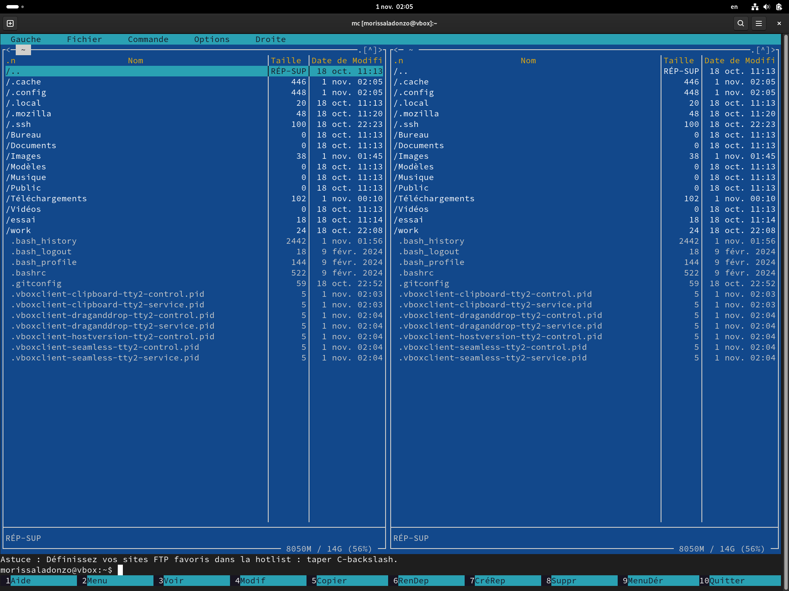{ #fig:001 width=70% }

В Midnight Commander используются функциональные клавиши F1 - F10:

| Клавиша | Выполняемое действие                                                                                                          |
|--------------|----------------------------------------------------------------------------------------------------------------------------|
| `F1`          | Вызов контекстно-зависимой подсказки                                                                               |
| `F2`      | Вызов меню, созданного пользователем     |
| `F3`       | Просмотр файла, на который указывает подсветка в активной панели                                           |
| `F4`      | Вызов встроенного редактора для файла, на который указывает подсветка в активной панели |
| `F5`     | Копирование файла или группы отмеченных файлов из каталога, отображаемого в активной панели, в каталог, отображаемый на второй панели                                                                                   |
| `F6`      | Перенос файла или группы отмеченных файлов из каталога, отображаемого в активной панели, в каталог, отображаемый на второй панели                                                                                   |
| `F7`       | Создание подкаталога в каталоге, отображаемом в активной панели                                                                                                            |
| `F8`       | Удаление файла (подкаталога) или группы отмеченных файлов                                                                                 |
| `F9`          | Вызов основного меню программы                                                                               |
| `F10`      | Выход из программу     |

Следующие комбинации клавиш облегчают работу с Midnight Commander:
• Tab используется для переключениями между панелями;
• ↑ и ↓ используется для навигации, Enter для входа в каталог или от-
крытия файла (если в файле расширений mc.ext заданы правила связи
определённых расширений файлов с инструментами их запуска или обра-
ботки);
• Ctrl + u (или через меню Команда > Переставить панели) меняет местами
содержимое правой и левой панелей;
Демидова А. В. 89
Архитектура ЭВМ
• Ctrl + o (или через меню Команда > Отключить панели ) скрывает или воз-
вращает панели Midnight Commander, за которыми доступен для работы
командный интерпретатор оболочки и выводимая туда информация.
• Ctrl + x + d (или через меню Команда > Сравнить каталоги) позволяет срав-
нить содержимое каталогов, отображаемых на левой и правой панелях.

__6.2.2. Структура программы на языке ассемблера NASM.__

Программа на языке ассемблера NASM, как правило, состоит из трёх секций:
секция кода программы (SECTION .text), секция инициированных (известных
во время компиляции) данных (SECTION .data) и секция неинициализирован-
ных данных (тех, под которые во время компиляции только отводится память,
а значение присваивается в ходе выполнения программы) (SECTION .bss).
Таким образом, общая структура программы имеет следующий вид:

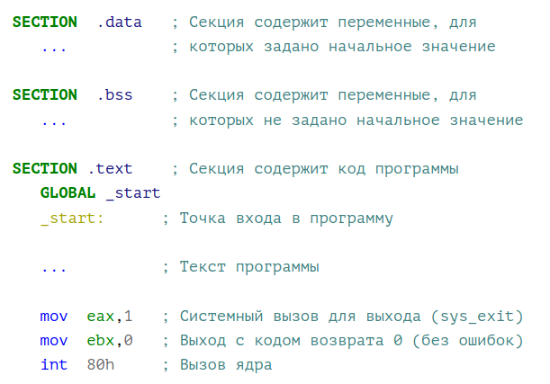{ #fig:002 width=70% }

Для объявления инициированных данных в секции .data используются ди-
рективы DB, DW, DD, DQ и DT, которые резервируют память и указывают, какие
значения должны храниться в этой памяти:
• DB (define byte) - определяет переменную размером в 1 байт;
• DW (define word) - определяет переменную размеров в 2 байта (слово);
• DD (define double word) - определяет переменную размером в 4 байта
(двойное слово);
• DQ (define quad word) - определяет переменную размером в 8 байт (учетве-
рённое слово);
• DT (define ten bytes) - определяет переменную размером в 10 байт.
Директивы используются для объявления простых переменных и для объяв-
ления массивов. Для определения строк принято использовать директиву DB в
связи с особенностями хранения данных в оперативной памяти.
Синтаксис директив определения данных следующий:
<имя> DB <операнд> `[, <операнд>] [, <операнд>]`

| Пример | Пояснение |
|--------------|----------------------------------------------------------------------------------------------------------------------------|
| `a db 10011001b` | Определяем переменную a размером 1 байт с начальным значением, заданным в двоичной системе счисления (на двоичную систему счисления указывает также буква b (binary) в конце числа) |
| `b db '!'` | Определяем переменную b в 1 байт, инициализируемую символом ! |
| `c db "Hello"` | Определяем строку из 5 байт |
| `d dd -345d` | Определяем переменную d размером 4 байта с начальным значением, заданным в десятичной системе счисления (на десятичную систему указывает буква d (decimal) в конце числа) |
| `h dd 0f1ah` | Определяем переменную h размером 4 байта с начальным значением, заданным в шестнадцатеричной системе счисления (h - hexadecimal) |

Для объявления неинициированных данных в секции .bss используются ди-
рективы resb, resw, resd и другие, которые сообщают ассемблеру, что необ-
ходимо зарезервировать заданное количество ячеек памяти. Примеры их ис-
пользования приведены в следующей таблице:

| Директива | Назначение директивы | Аргумент | Назначение аргумента |
|-----------|----------------------------------------|-----------------|--------------------------------------------------------------------|
| `resb` | Резервирование заданного числа однобайтовых ячеек | string resb 20 | По адресу с меткой string будет расположен массив из 20 однобайтовых ячеек (хранение строки символов) |
| `resw` | Резервирование заданного числа двухбайтовых ячеек (слов) | count resw 256 | По адресу с меткой count будет расположен массив из 256 двухбайтовых слов |
| `resd` | Резервирование заданного числа четырёхбайтовых ячеек (двойных слов) | x resd 1 | По адресу с меткой x будет расположено одно двойное слово (т.е. 4 байта для хранения большого числа) |

__6.2.3. Элементы программирования.__

__6.2.3.1. Описание инструкции mov.__

Инструкция языка ассемблера mov предназначена для дублирования данных
источника в приёмнике. В общем виде эта инструкция записывается в виде:
mov
dst,src
Здесь операнд dst - приёмник, а src - источник.
В качестве операнда могут выступать регистры (register), ячейки памяти
(memory) и непосредственные значения (const). В следующей таблице 
приведены варианты использования mov с разными операндами.

| Тип операндов | Пример | Пояснение |
|-----------|----------------------------------------|-----------------|--------------------------------------------------------------------|
| `mov <reg>,<reg>` | mov eax,ebx | Пересылает значение регистра ebx в регистр eax |
| `mov <reg>,<mem>` | mov cx,[eax] | Пересылает в регистр cx значение из памяти, указанной в eax |
| `mov <mem>,<reg>` | mov rez,ebx | Пересылает в переменную rez значение из регистра ebx |
| `mov <reg>,<const>` | mov eax,403045h | Пишет в регистр eax значение 403045h |
| `mov <mem>,<const>` | mov byte[rez],0 | Записывает в переменную rez значение 0 |
| `mov <mem>,<reg>` | mov rez,ebx | Пересылает в переменную rez значение из регистра ebx |

ВАЖНО! Переслать значение из одной ячейки памяти в другую нельзя, для
этого необходимо использовать две инструкции mov:
moveax, x
movy, eax
Также необходимо учитывать то, что размер операндов приемника и источни-
ка должны совпадать. Использование слудующих примеров приведет к ошибке:
• mov al,1000h - ошибка, попытка записать 2-байтное число в 1-байтный
регистр;
• mov eax,cx - ошибка, размеры операндов не совпадают.

__6.2.3.2. Описание инструкции int__

Инструкция языка ассемблера intпредназначена для вызова прерывания с
указанным номером. В общем виде она записывается в виде:
int n;
Здесь n — номер прерывания, принадлежащий диапазону 0–255.
При программировании в Linux с использованием вызовов ядра sys_calls
n=80h (принято задавать в шестнадцатеричной системе счисления).
После вызова инструкции int 80h выполняется системный вызов какой-либо
функции ядра Linux. При этом происходит передача управления ядру опера-
ционной системы.

__6.2.3.3. Системные вызовы для обеспечения диалога с пользователем__

Простейший диалог с пользователем требует наличия двух функций - выво-
да текста на экран и ввода текста с клавиатуры. Простейший способ 
вывести строку на экран - использовать системный вызов write. Этот 
системный вызов имеет номер 4, поэтому перед вызовом инструкции int 
необходимо поместить значение 4 в регистр eax. Первым аргументом 
write, помещаемым в регистр ebx, задаётся дескриптор файла. Для 
вывода на экран в качестве дескриптора файла нужно указать 1 (это озн-
ачает «стандартный вывод», т. е. вывод на экран). Вторым аргументом
задаётся адрес выводимой строки (помещаем его в регистр ecx, например, 
инструкцией mov ecx, msg). Строка может иметь любую длину.
Последним аргументом (т.е. в регистре edx) должна задаваться максима-
льная длина выводимой строки.
Для ввода строки с клавиатуры можно использовать аналогичный системный
вызов read. Его аргументы – такие же, как у вызова write, только для 
«чтения» с клавиатуры используется файловый дескриптор 0 (стандартный 
ввод). Системный вызов exit является обязательным в конце любой 
программы на языке ассемблер. Для обозначения конца программы перед 
вызовом инструкции int 80h необходимо поместить в регистр еах 
значение 1, а в регистр ebx код завершения 0.

# Выполнение лабораторной работы

Я открыл Midnight Commander (рис.3).

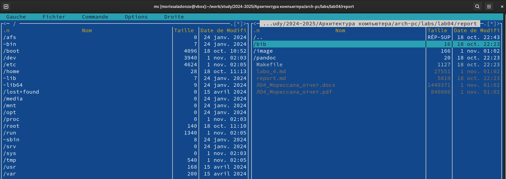{ #fig:003 width=70% }

Далее, пользуясь клавишами ↑ , ↓ и Enter, перешёл в каталог ~/work/arh-pc,
созданный мною при выполнении лабораторной работы №5 (рис.4).

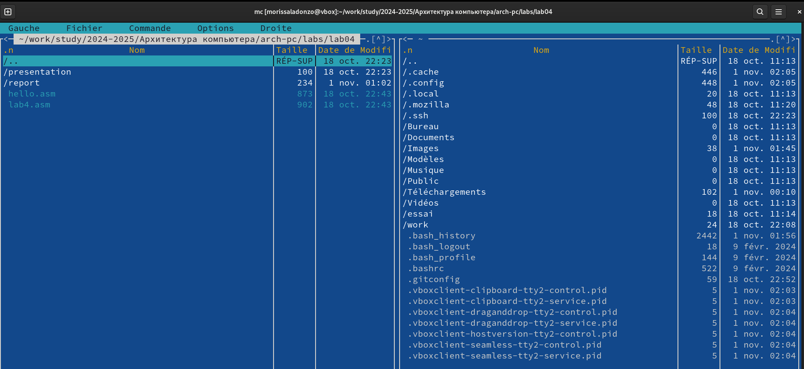{ #fig:004 width=70% }

С помощью функциональной клавиши F7 я создал папку lab06 (рис.5) 
и перешёл в созданный каталог.

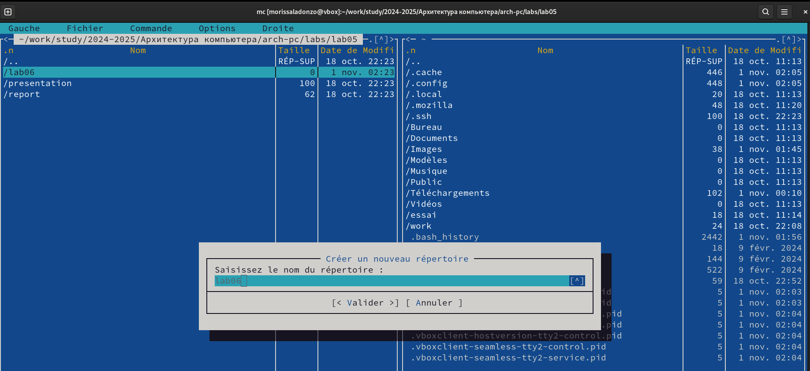{ #fig:005 width=70% }

После этого, пользуясь строкой ввода и командой touch, я создал файл 
lab6-1.asm (рис.6).

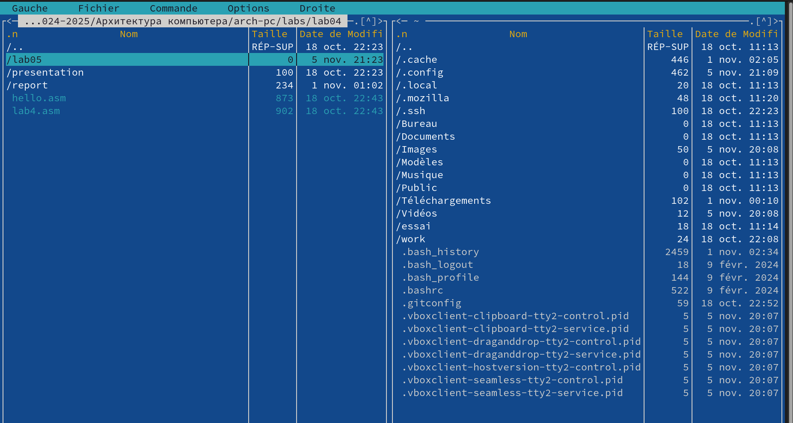{ #fig:006 width=70% }

Далее, с помощью клавиши F4 я открыл данный файл для редактирования
во встроенном редакторе и ввёл текст программы (рис.7).

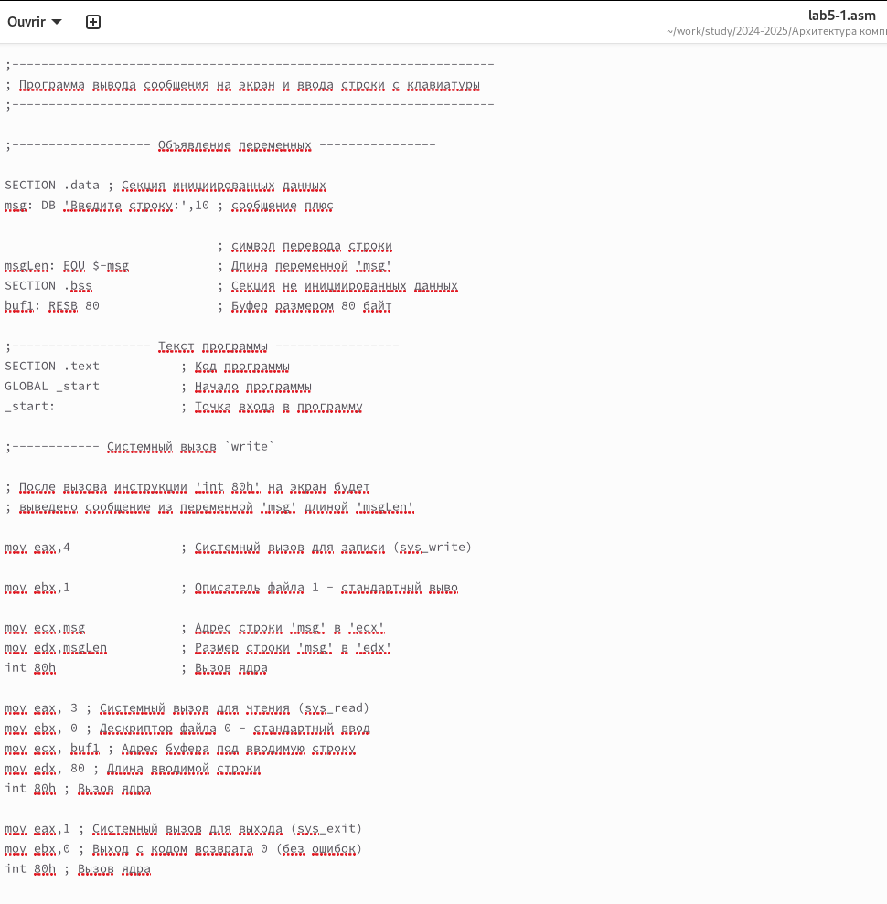{ #fig:007 width=70% }

С помощью функциональной клавиши F3 я открыл файл lab6-1.asm для
просмотра и убедился, что файл содержит текст программы.

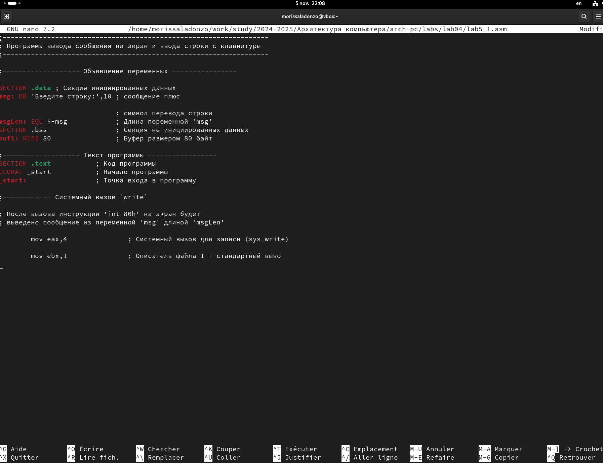{ #fig:008 width=70% }

Затем я оттранслировал текст программы lab6-1.asm в объектный файл, выполнив
компоновку объектного файла и запустил получившийся исполняемый файл (рис.9).

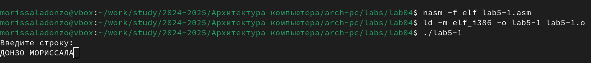{ #fig:009 width=70% }

Далее я скачал файл in_out.asm со страницы курса в ТУИС и переместил его в
каталог lab05, где находился файл с ассемблерной программой (рис.10).

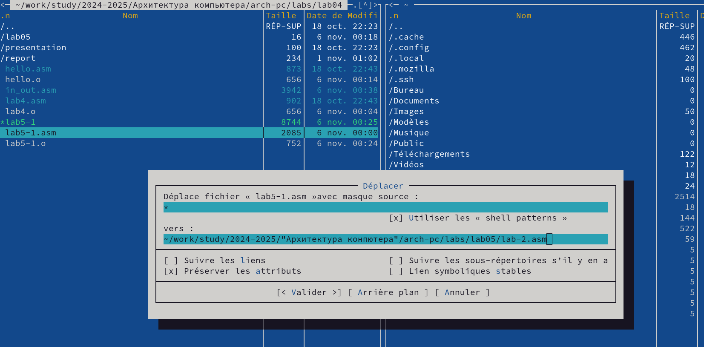{ #fig:010 width=70% }

Заменив текст программы в файле lab6-2.asm с использование под-
программ из внешнего файла in_out.asm (sprintLF, sread и quit)
я создал исполняемый файл и проверил его работу (рис.11-12).

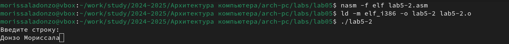{ #fig:011 width=70% }

{ #fig:012 width=70% }

После этого я заменил подпрограмму sprintLF на sprint в файле lab6-2.asm,
создал исполняемый файл и проверил его работу (рис.13-14).

{ #fig:013 width=70% }

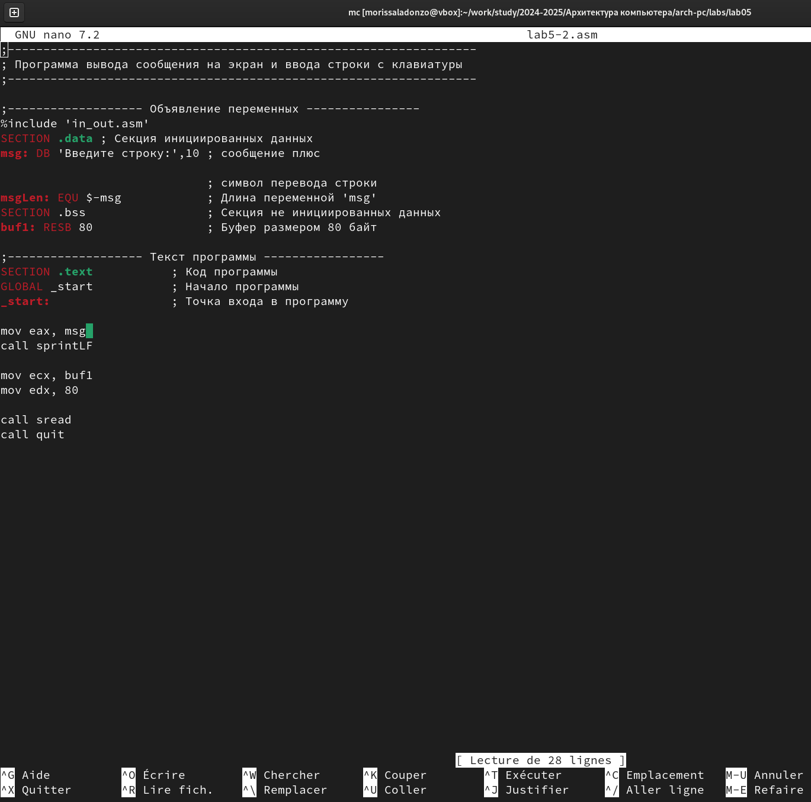{ #fig:014 width=70% }

Разница в работе программы заключается в отсутствии пустой строки после
запроса ввода.

## Выполнение заданий для самостоятельной работы

1. Создаю копию файла lab6-1.asm с именем lab6-1-1.asm с помощью функциональной клавиши F5 (рис. [-@fig:019]).

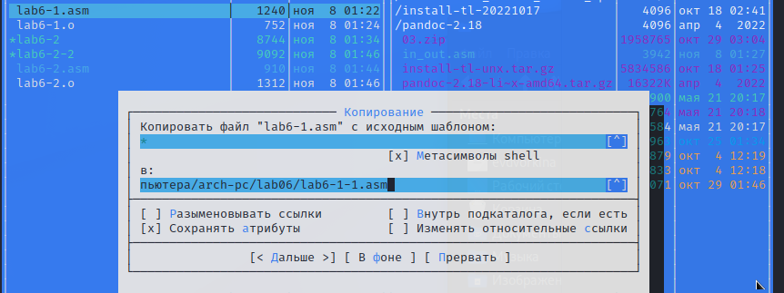{ #fig:019 width=70% }

С помощью функциональной клавиши F4 открываю созданный файл для редактирования. Изменяю программу так, чтобы кроме вывода приглашения и запроса ввода, она выводила вводимую пользователем строку (рис. [-@fig:020]). 

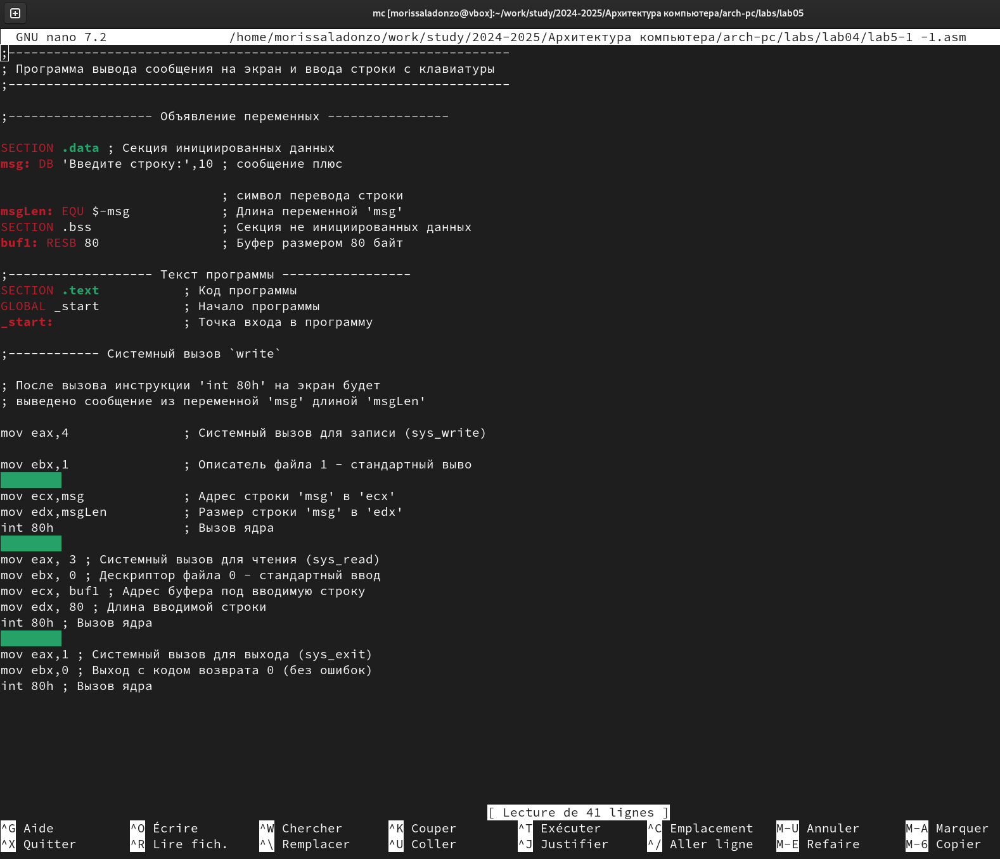{ #fig:020 width=70% }

2. Создаю объектный файл lab6-1-1.o, отдаю его на обработку компоновщику, получаю исполняемый файл lab6-1-1, запускаю полученный исполняемый файл. Программа запрашивает ввод, ввожу свои ФИО, далее программа выводит введенные мною данные (рис. [-@fig:021]).
 
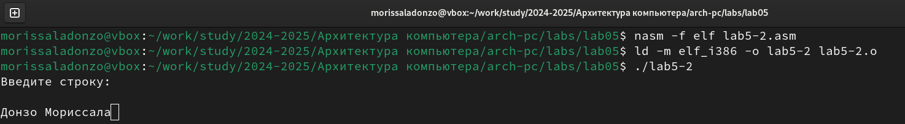{ #fig:021 width=70% }

Код программы из пункта 1:
```NASM
SECTION .data ; Секция инициированных данных
msg: DB 'Введите строку:',10
msgLen: EQU $-msg ; Длина переменной 'msg'
SECTION .bss ; Секция не инициированных данных
buf1: RESB 80 ; Буфер размером 80 байт
SECTION .text ; Код программы
GLOBAL _start ; Начало программы
_start: ; Точка входа в программу
mov eax,4 ; Системный вызов для записи (sys_write)
mov ebx,1 ; Описатель файла 1 - стандартный вывод
mov ecx,msg ; Адрес строки 'msg' в 'ecx'
mov edx,msgLen ; Размер строки 'msg' в 'edx'
int 80h ; Вызов ядра
mov eax, 3 ; Системный вызов для чтения (sys_read)
mov ebx, 0 ; Дескриптор файла 0 - стандартный ввод
mov ecx, buf1 ; Адрес буфера под вводимую строку
mov edx, 80 ; Длина вводимой строки
int 80h ; Вызов ядра
mov eax,4 ; Системный вызов для записи (sys_write)
mov ebx,1 ; Описатель файла '1' - стандартный вывод
mov ecx,buf1 ; Адрес строки buf1 в ecx
mov edx,buf1 ; Размер строки buf1
int 80h ; Вызов ядра
mov eax,1 ; Системный вызов для выхода (sys_exit)
mov ebx,0 ; Выход с кодом возврата 0 (без ошибок)
int 80h ; Вызов ядра
```

3. Создаю копию файла lab6-2.asm с именем lab6-2-1.asm с помощью функциональной клавиши F5 (рис. [-@fig:022]).

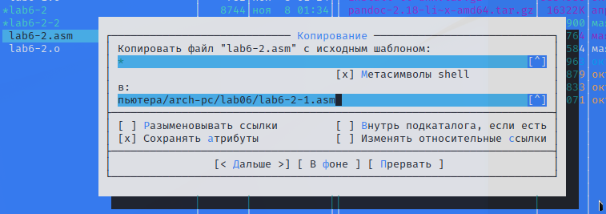{ #fig:022 width=70% }

С помощью функциональной клавиши F4 открываю созданный файл для редактирования. Изменяю программу так, чтобы кроме вывода приглашения и запроса ввода, она выводила вводимую пользователем строку (рис. [-@fig:023]). 

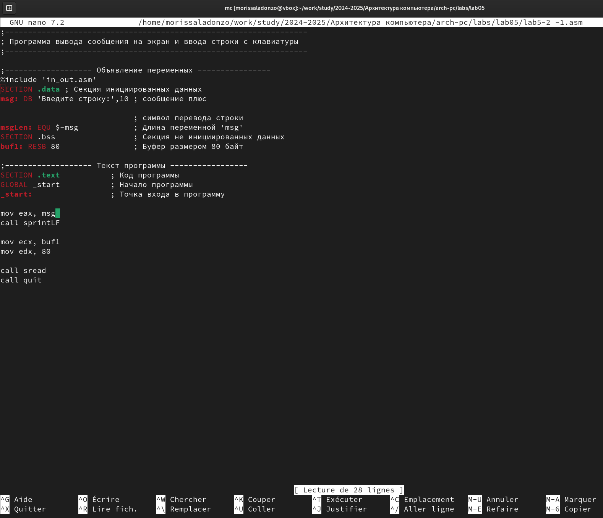{ #fig:023 width=70% }

4. Создаю объектный файл lab6-2-1.o, отдаю его на обработку компоновщику, получаю исполняемый файл lab6-2-1, запускаю полученный исполняемый файл. Программа запрашивает ввод без переноса на новую строку, ввожу свои ФИО, далее программа выводит введенные мною данные (рис. [-@fig:024]).

{ #fig:024 width=70% }

Код программы из пункта 3:

```NASM
%include 'in_out.asm'
SECTION .data ; Секция инициированных данных
msg: DB 'Введите строку: ',0h ; сообщение
SECTION .bss ; Секция не инициированных данных
buf1: RESB 80 ; Буфер размером 80 байт
SECTION .text ; Код программы
GLOBAL _start ; Начало программы
_start: ; Точка входа в программу
mov eax, msg ; запись адреса выводимого сообщения в `EAX`
call sprint ; вызов подпрограммы печати сообщения
mov ecx, buf1 ; запись адреса переменной в `EAX`
mov edx, 80 ; запись длины вводимого сообщения в `EBX`
call sread ; вызов подпрограммы ввода сообщения
mov eax,4 ; Системный вызов для записи (sys_write)
mov ebx,1 ; Описатель файла '1' - стандартный вывод
mov ecx,buf1 ; Адрес строки buf1 в ecx
int 80h ; Вызов ядра
call quit ; вызов подпрограммы завершения
```

# Выводы

В результате выполнения данной лабораторной работы я преобрел практические 
навыки работы в Midnight Commander и освоил инструкции языка ассемблера mov и int.

# Список литературы{.unnumbered}

Лабораторная работа №6 (Архитектура ЭВМ).
