---
## Front matter
title: "Отчёт по лабораторной работе №7"
subtitle: "Выполнил студент НКАбд-01-24"
author: "Мориссала Донзо"

## Generic otions
lang: ru-RU
toc-title: "Содержание"

## Bibliography
bibliography: bib/cite.bib
csl: pandoc/csl/gost-r-7-0-5-2008-numeric.csl

## Pdf output format
toc: true # Table of contents
toc-depth: 2
lof: true # List of figures
lot: true # List of tables
fontsize: 12pt
linestretch: 1.5
papersize: a4
documentclass: scrreprt
## I18n polyglossia
polyglossia-lang:
  name: russian
  options:
	- spelling=modern
	- babelshorthands=true
polyglossia-otherlangs:
  name: english
## I18n babel
babel-lang: russian
babel-otherlangs: english
## Fonts
mainfont: PT Serif
romanfont: PT Serif
sansfont: PT Sans
monofont: PT Mono
mainfontoptions: Ligatures=TeX
romanfontoptions: Ligatures=TeX
sansfontoptions: Ligatures=TeX,Scale=MatchLowercase
monofontoptions: Scale=MatchLowercase,Scale=0.9
## Biblatex
biblatex: true
biblio-style: "gost-numeric"
biblatexoptions:
  - parentracker=true
  - backend=biber
  - hyperref=auto
  - language=auto
  - autolang=other*
  - citestyle=gost-numeric
## Pandoc-crossref LaTeX customization
figureTitle: "Рис."
tableTitle: "Таблица"
listingTitle: "Листинг"
lofTitle: "Список иллюстраций"
lotTitle: "Список таблиц"
lolTitle: "Листинги"
## Misc options
indent: true
header-includes:
  - \usepackage{indentfirst}
  - \usepackage{float} # keep figures where there are in the text
  - \floatplacement{figure}{H} # keep figures where there are in the text
---

# Цель работы

Изучение команд условного и безусловного переходов. Приобретение навы-
ков написания программ с использованием переходов. Знакомство с назначе-
нием и структурой файла листинга.

# Задание

__8.3.1. Реализация переходов в NASM__

1. Создайте каталог для программам лабораторной работы No 8, перейдите в
него и создайте файл lab8-1.asm:
mkdir ~/work/arch-pc/lab08
cd ~/work/arch-pc/lab08
touch lab8-1.asm
2. Инструкция jmp в NASM используется для реализации безусловных пере-
ходов. Рассмотрим пример программы с использованием инструкции jmp.
Введите в файл lab8-1.asm текст программы из предложенного листинга.

Создайте исполняемый файл и запустите его. Результат работы данной про-
граммы будет следующим:
user@dk4n31:~$ ./lab8-1
Сообщение No 2
Сообщение No 3
user@dk4n31:~$
Таким образом, использование инструкции jmp _label2 меняет порядок ис-
полнения инструкций и позволяет выполнить инструкции начиная с метки
_label2, пропустив вывод первого сообщения.
Инструкция jmp позволяет осуществлять переходы не только вперед но
и назад. Изменим программу таким образом, чтобы она выводила сначала
‘Сообщение No 2’, потом ‘Сообщение No 1’ и завершала работу. Для этого в
текст программы после вывода сообщения No 2 добавим инструкцию jmp с
меткой _label1 (т.е. переход к инструкциям вывода сообщения No 1) и после
вывода сообщения No 1 добавим инструкцию jmp с меткой _end (т.е. переход к
инструкции call quit). Измените текст программы в соответствии с листингом.

Измените текст программы добавив или изменив инструкции jmp, чтобы
вывод программы был следующим:
user@dk4n31:~$ ./lab8-1
Сообщение No 3
Сообщение No 2
Сообщение No 1
user@dk4n31:~$
3. Использование инструкции jmp приводит к переходу в любом случае. Од-
нако, часто при написании программ необходимо использовать условные
переходы, т.е. переход должен происходить если выполнено какое-либо
условие. В качестве примера рассмотрим программу, которая определяет
и выводит на экран наибольшую из 3 целочисленных переменных: A,B
и C. Значения для A и C задаются в программе, значение B вводиться с
клавиатуры.

Создайте исполняемый файл и проверьте его работу.

# Теоретическое введение

Для реализации ветвлений в ассемблере используются так называемые ко-
манды передачи управления или команды перехода. Можно выделить 2 типа
переходов:
• условный переход – выполнение или не выполнение перехода в определен-
ную точку программы в зависимости от проверки условия.
• безусловный переход – выполнение передачи управления в определенную
точку программы без каких-либо условий.

__8.2.1. Команды безусловного перехода.__

Безусловный переход выполняется инструкцией jmp (от англ. jump – прыжок),
которая включает в себя адрес перехода, куда следует передать управление:
mp <адрес_перехода>
Адрес перехода может быть либо меткой, либо адресом области памяти, в
которую предварительно помещен указатель перехода. Кроме того, в качестве
операнда можно использовать имя регистра, в таком случае переход будет осу-
ществляться по адресу, хранящемуся в этом регистре.

| Тип операнда | Описание |
|--------------|----------------------------------------------------------------------------------------------------------------------------|
| `jmp label`  | Переход на метку labe |
| `mp [label]` | Переход по адресу в памяти, помеченному меткой label |
| `jmp eax`    | Переход по адресу из регистра eax |

В следующем примере рассмотрим использование инструкции jmp:

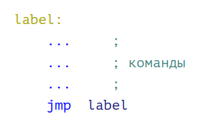{ #fig:001 width=70% }

__8.2.2. Команды условного перехода__

Как отмечалось выше, для условного перехода необходима проверка какого-
либо условия. В ассемблере команды условного перехода вычисляют условие
перехода анализируя флаги из регистра флагов.

__8.2.2.1. Регистр флагов.__

Флаг – это бит, принимающий значение 1 («флаг установлен»), если выпол-
нено некоторое условие, и значение 0 («флаг сброшен») в противном случае.
Флаги работают независимо друг от друга, и лишь для удобства они помещены в
единый регистр — регистр флагов, отражающий текущее состояние процессора.
В следующей таблице указано положение битовых флагов в регистре флагов:

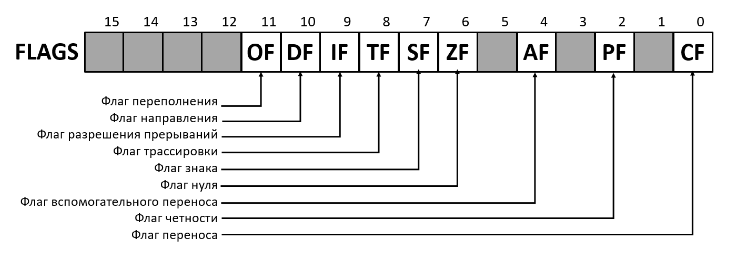{ #fig:002 width=70% }

Флаги состояния (биты 0, 2, 4, 6, 7 и 11) отражают результат выполнения
арифметических инструкций, таких как ADD, SUB, MUL, DIV.

__8.2.2.2. Описание инструкции cmp.__

Инструкция cmp является одной из инструкций, которая позволяет сравнить
операнды и выставляет флаги в зависимости от результата сравнения.
Инструкция cmp является командой сравнения двух операндов и имеет такой
же формат, как и команда вычитания:
cmp <операнд_1>, <операнд_2>
Команда cmp, так же как и команда вычитания, выполняет вычитание
<операнд_2> - <операнд_1>, но результат вычитания никуда не записывается
и единственным результатом команды сравнения является формирование
флагов.
Примеры:

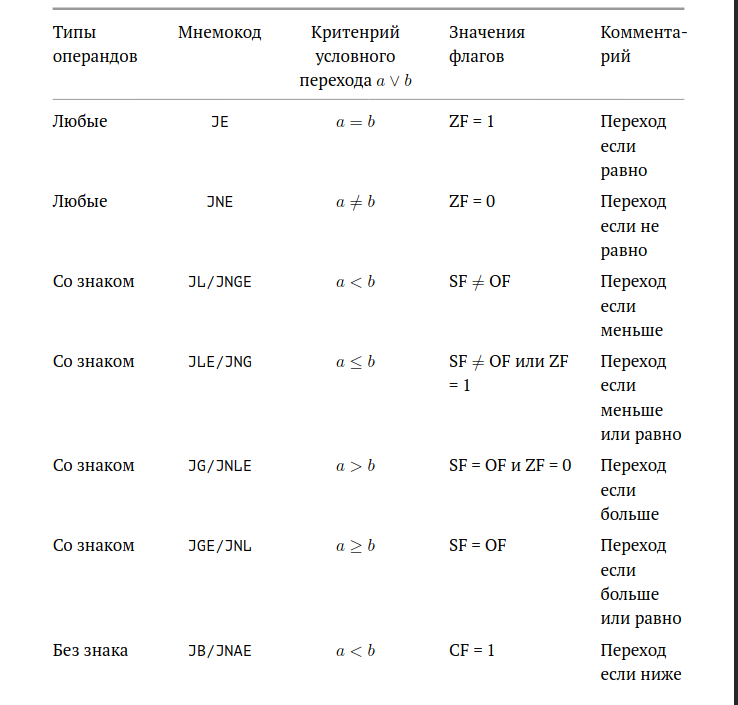{ #fig:003 width=70% }

__8.2.2.3. Описание команд условного перехода.__

Команда условного перехода имеет вид
j<мнемоника перехода> label
Мнемоника перехода связана со значением анализируемых флагов или со
способом формирования этих флагов.
В табл. 8.3. представлены команды условного перехода, которые обычно ста-
вятся после команды сравнения cmp. В их мнемокодах указывается тот резуль-
тат сравнения, при котором надо делать переход. Мнемоники, идентичные по
своему действию, написаны в таблице через дробь (например, ja и jnbe). Про-
граммист выбирает, какую из них применить, чтобы получить более простой
для понимания текст программы.

Инструкции условной передачи управления по результатам
арифметического сравнения cmp a,b

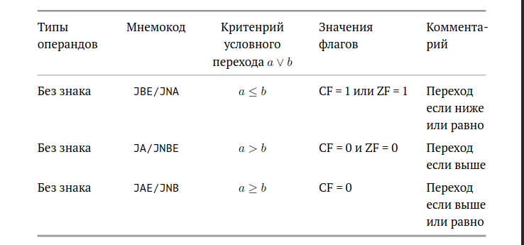{ #fig:004 width=70% }

{ #fig:005 width=70% }

Примечание: термины «выше» («a» от англ. «above») и «ниже» («b» от англ.
«below») применимы для сравнения беззнаковых величин (адресов), а термины
«больше» («g» от англ. «greater») и «меньше» («l» от англ. «lower») используются
при учёте знака числа. Таким образом, мнемонику инструкции JA/JNBE можно
расшифровать как «jump if above (переход если выше) / jump if not below equal
(переход если не меньше или равно)».
Помимо перечисленных команд условного перехода существуют те, которые
которые можно использовать после любых команд, меняющих значения флагов.

{ #fig:006 width=70% }

{ #fig:007 width=70% }

В качестве примера рассмотрим фрагмент программы, которая выполняет
умножение переменных a и b и если произведение превосходит размер байта,
передает управление на метку Error.
mov al, a
mov bl, b
mul bl
jc Error

__8.2.3. Файл листинга и его структура.__

Листинг (в рамках понятийного аппарата NASM) — это один из выходных фай-
лов, создаваемых транслятором. Он имеет текстовый вид и нужен при отладке
программы, так как кроме строк самой программы он содержит дополнитель-
ную информацию.
Ниже приведён фрагмент файла листинга.

{ #fig:008 width=70% }

Все ошибки и предупреждения, обнаруженные при ассемблировании, транс-
лятор выводит на экран, и файл листинга не создаётся.
Итак, структура листинга:
• номер строки — это номер строки файла листинга (нужно помнить, что
номер строки в файле листинга может не соответствовать номеру строки
в файле с исходным текстом программы);
• адрес — это смещение машинного кода от начала текущего сегмента;
• машинный код представляет собой ассемблированную исходную строку
в виде шестнадцатеричной последовательности. (например, инструкция
int 80h начинается по смещению 00000020 в сегменте кода; далее идёт
машинный код, в который ассемблируется инструкция, то есть инструкция
int 80h ассемблируется в CD80 (в шестнадцатеричном представлении);
CD80 — это инструкция на машинном языке, вызывающая прерывание
ядра);
• исходный текст программы — это просто строка исходной программы вме-
сте с комментариями (некоторые строки на языке ассемблера, например,
строки, содержащие только комментарии, не генерируют никакого ма-
шинного кода, и поля «смещение» и «исходный текст программы» в таких
строках отсутствуют, однако номер строки им присваивается).

# Выполнение лабораторной работы

__8.3.1. Реализация переходов в NASM.__

Первым делом я создал каталог для программам лабораторной работы No 8,
перешёл в него и создал файл lab8-1.asm (рис.9).

{ #fig:009 width=80% }

Далее, для корректной работы я скопировал внешний файл в созданный
каталог, ввёл текст программы с использованием инструкции jmp 
в текстовый файл lab8-1.asm, создал объектный файл и проверил
работы программы (рис.10-12).

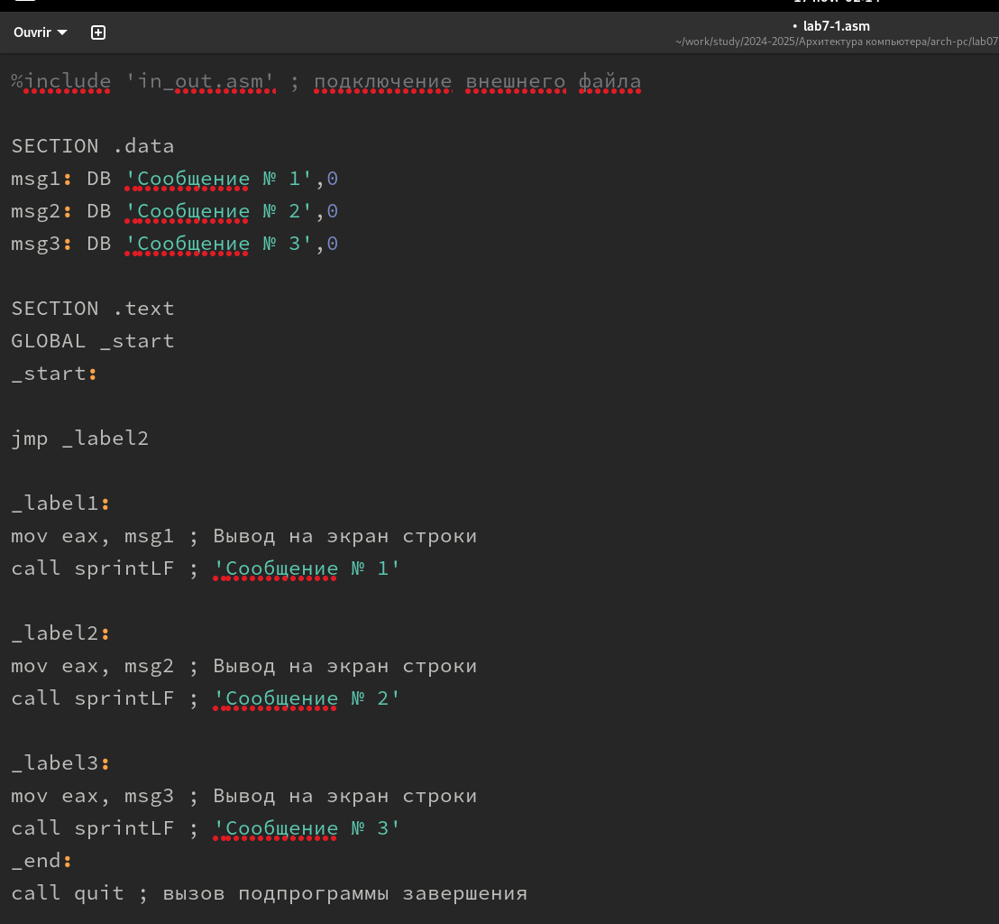{ #fig:010 width=80% }

{ #fig:011 width=80% }

{ #fig:012 width=80% }

Затем я изменил текст программы в соответствии с предложенным
лестинингом и проверил её работу (рис.13-14).

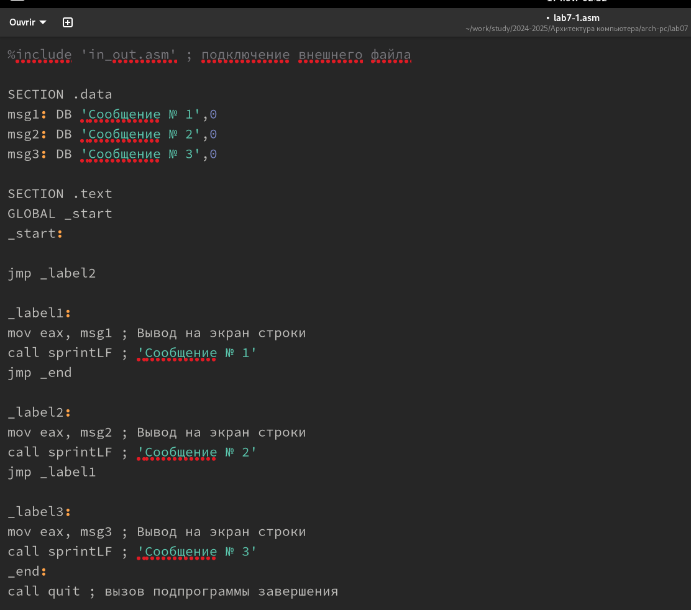{ #fig:013 width=80% }

{ #fig:014 width=80% }

Затем я изменил текст программы таким образом, чтобы сообщения
выводились в следующей последовательности: 3, 2, а затем 1 (рис.15).

{ #fig:015 width=80% }

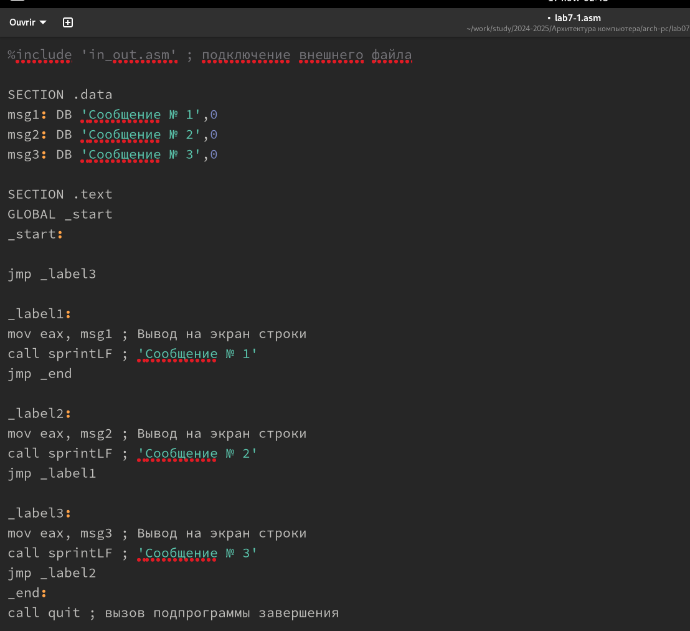{ #fig:016 width=80% }

Описываются проведённые действия, в качестве иллюстрации даётся ссылка на иллюстрацию (рис. [-@fig:001])

Создайте файл lab7-2.asm в каталоге ~/work/arch-pc/lab07. Внимательно изучите текст
программы из листинга 7.3 и введите в lab7-2.asm.

{ #fig:017 width=80% }

Программа, которая определяет и выводит на экран наибольшую из 3
целочисленных переменных: A,B и C

{ #fig:018 width=80% }
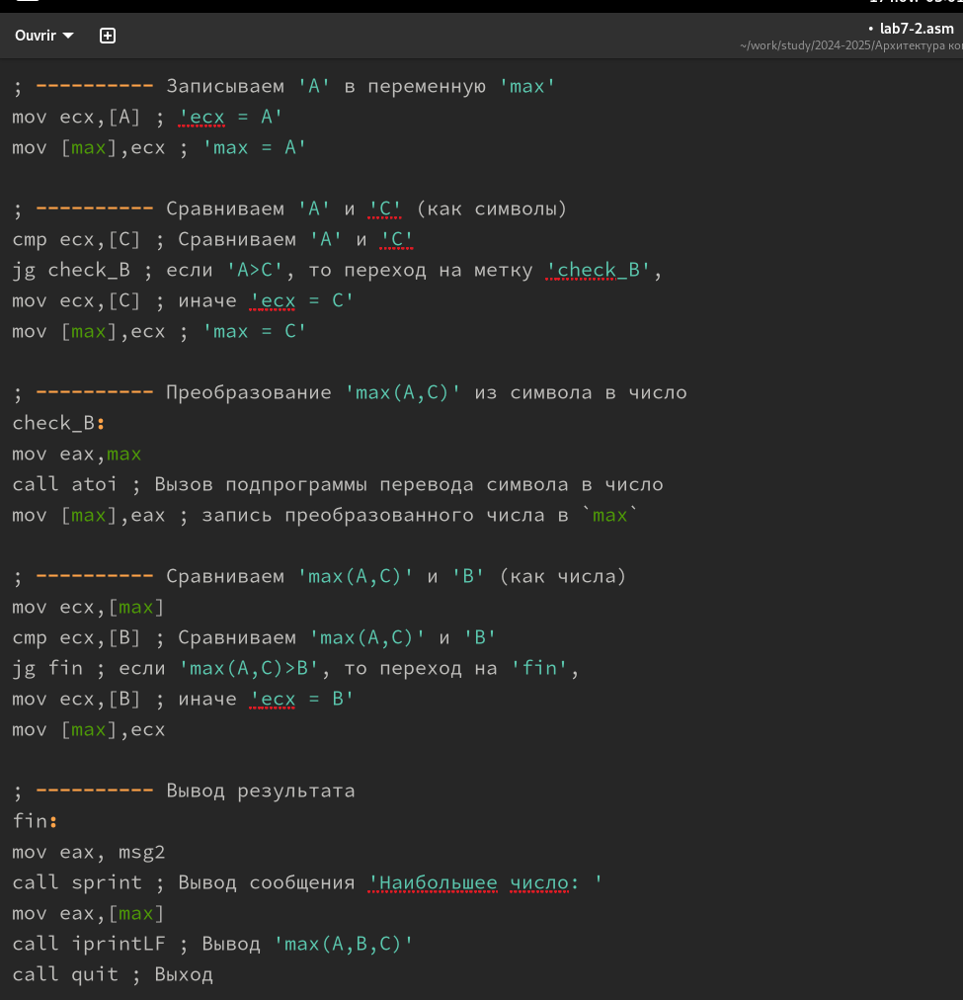{ #fig:019 width=80% }

Создайте исполняемый файл и проверьте его работу для разных значений B.

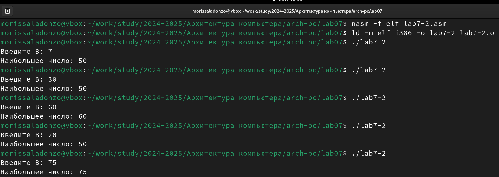{ #fig:020 width=80% }

## Изучение структуры файлы листинга
Получитьфайл листинга можно, указав ключ -l и задав имя файла листинга в командной строке.
Создайте файл листинга для программы из файла lab7-2.asm

{ #fig:021 width=80% }

Откройте файл листинга lab7-2.lst с помощью любого текстового редактора, 

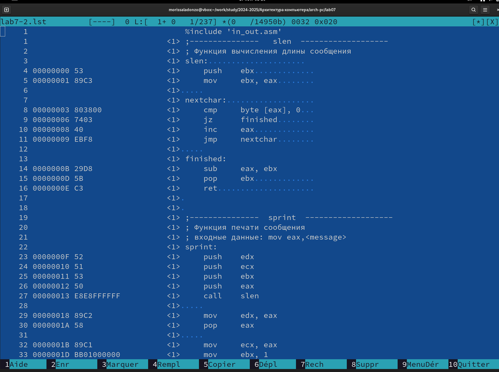{ #fig:022 width=70% }

## Выполнение заданий для самостоятельной работы

Напишите программу нахождения наименьшей из 3 целочисленных переменных 𝑎,𝑏 и .
Значения переменных выбрать из табл. 7.5 в соответствии с вариантом, полученным
при выполнении лабораторной работы № 7. Создайте исполняемый файл и проверьте
его работу

{ #fig:023 width=80% }
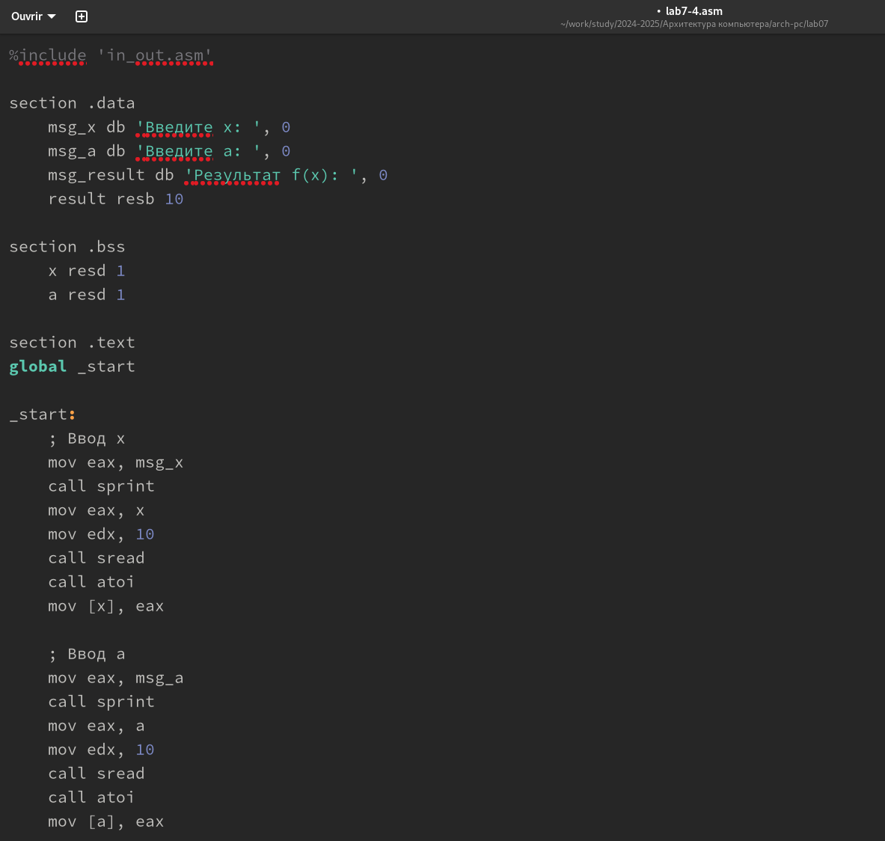{ #fig:024 width=80% }
{ #fig:025 width=80% }

Напишите программу, которая для введенных с клавиатуры значений 𝑥 и 𝑎 вычисляет
значение заданной функции 𝑓(𝑥) и выводит результат вычислений

{ #fig:026 width=80% }

# Выводы

В результате выполнения данной лабораторной работы, я изучил 
команды условного и безусловного переходов, приобретел навыки
написания программ с использованием переходов и понакомился с 
назначением и структурой файла листинга.

# Список литературы{.unnumbered}

Лабораторная работа №7 (Архитектура ЭВМ).
